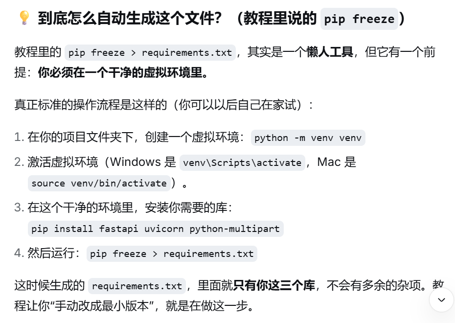

1. 判断音频时长
————subprocess的run方法，这个方法接受指令，会抛出错误，把指令输出作为文本格式输出，返回一个对象。封装了一个终端命令执行函数专门处理指令执行和异常统一。

2. 保存上传的文件
————文件传输是流式传输，一个很大的文件是一点点传的，而不是等用户传完（可能要等十几秒，延迟，并且一口气读完内存万一超限制了又要删掉这个文件，白读了）然后一口气读完，所以传一点就读一点，读到超出限制，就把本来存的这个文件的临时文件删掉，避免占内存。
：在浏览器发请求时请求头会有一个字段（Content-Length），这个字段可以标注内容长度，但是这个数据可以被伪造，同理上传文件有size属性，也是自己可以定义声明的，不可信。所以不能根据这个判断数据大小
3. 
————部署项目到平台上需要requirements这个文件，这个文件告诉部署平台需要准备什么py环境